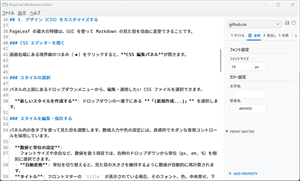

# PageLeaf 使い方ガイド 🍃

PageLeaf は、文章の執筆とデザインの調整を直感的に行える Markdown エディタです。
プレビューを見ながらリアルタイムに編集し、あなただけの美しいドキュメントを作成しましょう。

---

## 1. 文章を書く 🖋️

### ファイルを開く・保存する

まずは編集するファイルを用意しましょう。

- **新しく作る**: `Ctrl + N`
- **ファイルを開く**:
  - `Ctrl + O` を押してファイルを選択します。
  - または、編集したいファイルをウィンドウへ直接**ドラッグ＆ドロップ**します。
- **保存する**: `Ctrl + S`

### 2つのモードを使い分ける

作業の内容に合わせて、最適な表示モードを選びましょう。
画面右上のボタン、または `Shift + Alt + ← / →` で瞬時に切り替えられます。未保存の変更がある場合は、アイコンの左上に小さなドットが表示されます。

- **書くことに集中したいとき (編集モード)**
  ペンアイコン🖋を選択します。Markdown 記法そのものを編集するモードです。
- **仕上がりを確認したいとき (ビューアーモード)**
  目のアイコン👁を選択します。CSS が適用された最終的なデザインを確認できます。

### サクサク入力するための支援機能

PageLeaf は、執筆をスムーズにするための多くの入力支援機能を備えています。

- **リストの自動入力**: 箇条書き（`-` や `1.`）の行で改行すると、次の行にも自動で記号が入力されます。
- **記号の補完**: `(` や `[` を入力すると、自動的に閉じ記号が補完されます。
- **画像の貼り付け**: クリップボードに画像がある状態で `Ctrl + Shift + V` を押すと、画像をファイルとして保存し、リンクを自動挿入します。
- **脚注（注釈）の挿入**: `Ctrl + Alt + F` を押すとポップアップが表示され、本文への記号挿入と文末への定義追加を一度に行えます。[^1]
- **目次へのジャンプ**: 右上のリストアイコン📑を押すと目次が表示され、クリックするだけでその見出しへ移動します。

---

## 2. デザインを整える 🎨

PageLeaf の最大の特徴は、CSS（スタイルシート）の知識がなくても、マウス操作だけで Markdown の見た目を自由に変更できることです。
画面右端の境界線にある「◀」ボタンをクリックして、**デザインパネル**を開きましょう。

### デザインの基本操作

1. **デザインを選ぶ**: パネル上部のメニューから、適用したいスタイルファイルを選んでください。
2. **パーツごとに調整する**: パネル内のタブ（全体、タイトル、見出しなど）を切り替えて、各部分の見た目を変えていきます。
3. **仕上がりを確認する**: 変更はリアルタイムにプレビューへ反映されます。納得がいくまで調整してください。
4. **保存する**: 調整が終わったら、パネル上部の保存ボタンを押してデザインを確定させましょう。

### 各タブで調整できること

作成する文書の目的に合わせて、各パーツをカスタマイズしましょう。

- **「全体」タブ**
  文書全体の基本となるフォント（字体）、文字の大きさ、色、背景色などを設定します。また、**行間**や**段落下の余白**、日本語の文章作法である**行頭の字下げ**もここで調整できます。まずはここで全体の雰囲気を決めましょう。
- **「タイトル」タブ**
  文書の最上部に表示されるタイトルのデザインです。中央寄せにしたり、少し大きめのフォントサイズにしたりすることで、表紙のような特別感を演出できます。(※「タイトル」はフロントマターの「title」を表示する独自機能です。アプリの設定で有効にしたときだけ表示されます。)
- **「見出し (H1〜H6)」タブ**
  章や節のタイトルを装飾します。
  - **自動採番**: 「1.1.1」のような項番を自動で付与するかどうかを選択できます。
  - **境界線**: 見出しの下に線を引き、区切りを強調することも可能です。
- **「段落・リスト」タブ**
  本文の行間や、箇条書きのスタイルを調整します。
- **「引用・コード」タブ**
  引用文の背景色や、プログラミングコードを表示する枠のデザインをカスタマイズします。
- **「注釈 (Footnotes)」タブ**
  脚注の記号（色、太字、括弧の有無）や、文末の注釈エリアのデザインを調整します。戻るリンク（↩）の表示・非表示もここで切り替え可能です。[^2]

### 直感的な調整ツール

- **数値と単位の切り替え**:
  文字の大きさなどを変える際、単位（px, em, %）を切り替えても、PageLeaf が自動的に数値を計算して「見た目の大きさ」を維持します。難しい計算はアプリに任せて、好みの単位を選んでください。
- **パレットで色を選ぶ**:
  色の設定欄にあるパレットアイコンをクリックすると、直感的に色を選べるカラーピッカーが開きます。
- **いつでもやり直せる**:
  調整に失敗しても大丈夫です。パネル上部の「リセットボタン」を押せば、最後に保存した状態（元のデザイン）に戻せます。

---

## 3. 文書ごとの特別な設定 ⚙️

特定の文書に対して「常にこのデザインで開きたい」「プレビューにタイトルを表示したい」といった個別の設定を行いたいときは、画面右下の**文書情報パネル**を活用しましょう。

### こんなときに便利です

パネル内の項目を入力・選択することで、文書ごとに以下の設定を保存できます。

- **プレビューにタイトルを表示する (`title`)**
  「タイトル」欄に文字を入力すると、プレビューの最上部にそのタイトルが表示されます。文書の中にわざわざ見出しを書かなくても、表紙のような美しいタイトルが自動的に添えられます。
- **お気に入りのデザインを固定する (`css`)**
  「デザイン(css)」欄にスタイル名を指定しておくと、次回そのファイルを開いたときに、自動的にそのデザインが適用されます。文書を開くたびにデザインを選び直す手間が省けます。
- **プログラムコードの色を変える (`syntax_highlight`)**
  「ハイライト(syntax_highlight)」欄でテーマを選ぶと、その文書内のコードブロックの色付けを個別に指定できます。

これらの設定はファイル自体に記録されるため、一度設定しておけば、次に開いたときも同じ状態で作業を再開できます。

---

## 4. ショートカットキー一覧 ⌨️

よく使う操作はショートカットキーで素早く行いましょう。

| 操作                 | キー                  |
| :------------------- | :-------------------- |
| **モード切替**       | `Shift + Alt + ← / →` |
| **新規作成**         | `Ctrl + N`            |
| **開く**             | `Ctrl + O`            |
| **保存**             | `Ctrl + S`            |
| **名前を付けて保存** | `Ctrl + Shift + S`    |
| **画像貼り付け**     | `Ctrl + Shift + V`    |
| **改ページ挿入**     | `Shift + Enter`       |
| **太字**             | `Ctrl + B`            |
| **斜体**             | `Ctrl + I`            |
| **取り消し線**       | `Ctrl + Shift + X`    |
| **インラインコード** | `Ctrl + Shift + C`    |
| **リンク挿入**       | `Ctrl + K`            |
| **タスクリスト切替** | `Ctrl + L`            |
| **見出し設定**       | `Ctrl + 1` 〜 `6`     |
| **脚注（注釈）挿入** | `Ctrl + Alt + F`      |

---

## 5. 困ったときは ❓

### 操作方法や記法を忘れたら

メニューの「ヘルプ > **チートシート**」を開いてください。
Markdown の記法やショートカットキーの一覧をいつでも確認できる、便利な早見表ウィンドウが表示されます。

### 設定を変更したい

文字の大きさや画像の保存先など、アプリ全体の挙動はメニューの「設定」から変更してください。

[^1]: 注釈の定義は自動的に文書の末尾へ集められます。また、設定により保存時に番号を登場順に自動で振り直すことも可能です。

[^2]: プレビュー画面では、脚注記号や戻るリンクをクリックすることで、本文と注釈の間を双方向に行き来できます。
