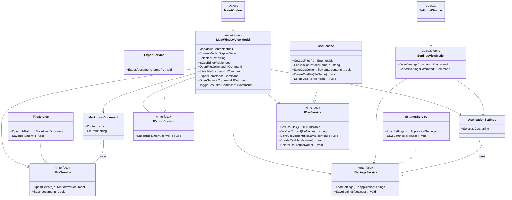

```mermaid
classDiagram
    class MainWindow {
        <<View>>
    }
    class SettingsWindow {
        <<View>>
    }

    class MainWindowViewModel {
        <<ViewModel>>
        +MarkdownContent: string
        +CurrentMode: DisplayMode
        +SelectedCss: string
        +IsCssEditorVisible: bool
        +OpenFileCommand: ICommand
        +SaveFileCommand: ICommand
        +ExportCommand: ICommand
        +OpenSettingsCommand: ICommand
        +ToggleCssEditorCommand: ICommand
    }
    class SettingsViewModel {
        <<ViewModel>>
        +SaveSettingsCommand: ICommand
        +CancelSettingsCommand: ICommand
    }

    class MarkdownDocument {
        +Content: string
        +FilePath: string
    }
    class ApplicationSettings {
        +SelectedCss: string
    }

    class IFileService {
        <<Interface>>
        +Open(filePath): MarkdownDocument
        +Save(document): void
    }
    class FileService {
        +Open(filePath): MarkdownDocument
        +Save(document): void
    }

    class IExportService {
        <<Interface>>
        +Export(document, format): void
    }
    class ExportService {
        +Export(document, format): void
    }

    class ISettingsService {
        <<Interface>>
        +LoadSettings(): ApplicationSettings
        +SaveSettings(settings): void
    }
    class SettingsService {
        +LoadSettings(): ApplicationSettings
        +SaveSettings(settings): void
    }

    class ICssService {
        <<Interface>>
        +GetCssFiles(): IEnumerable<string>
        +GetCssContent(fileName): string
        +SaveCssContent(fileName, content): void
        +CreateCssFile(fileName): void
        +DeleteCssFile(fileName): void
    }
    class CssService {
        +GetCssFiles(): IEnumerable<string>
        +GetCssContent(fileName): string
        +SaveCssContent(fileName, content): void
        +CreateCssFile(fileName): void
        +DeleteCssFile(fileName): void
    }

    MainWindow --> MainWindowViewModel
    SettingsWindow --> SettingsViewModel

    MainWindowViewModel --> MarkdownDocument
    MainWindowViewModel --> IFileService
    MainWindowViewModel --> IExportService
    MainWindowViewModel --> ISettingsService
    MainWindowViewModel --> ICssService
    MainWindowViewModel --> ApplicationSettings

    SettingsViewModel --> ISettingsService
    SettingsViewModel --> ApplicationSettings

    FileService ..|> IFileService
    ExportService ..|> IExportService
    SettingsService ..|> ISettingsService
    CssService ..|> ICssService

    ApplicationSettings "1" -- "1" ISettingsService : uses
    MarkdownDocument "1" -- "1" IFileService : uses
```