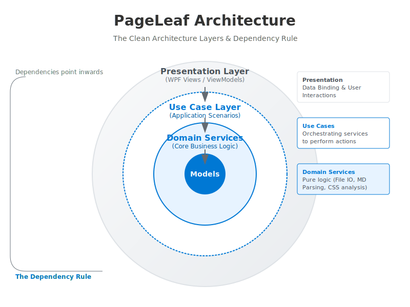

# 技術仕様：アーキテクチャ設計規約

## 1. レイヤー分離とコード構造の対応

本プロジェクトはクリーンアーキテクチャに基づき、以下の通りコードを配置する。依存関係は常に下表の「上位」から「下位」へと向かう一方向（外側から内側）とし、中心にあるドメインモデルがビジネスルールを保持するものとする。

| レイヤー (概念)      | ディレクトリ    | 主な責務・内容                                                                  | 依存の方向 |
| :------------------- | :-------------- | :------------------------------------------------------------------------------ | :--------- |
| **Presentation**     | `Views/`        | WPF UI定義 (XAML, Code-behind) を行う                                           | ↓ Use Case |
|                      | `ViewModels/`   | Viewの表示データ保持とユーザー操作の受付けを担う                                |            |
|                      | `Behaviors/`    | Viewの純粋なUIロジック（添付ビヘイビア）を記述する                              |            |
| **Use Case**         | `UseCases/`     | アプリケーション固有のルールを定義し、Service/Modelを組み合わせた手順を記述する | ↓ Domain   |
| **Domain (Service)** | `Services/`     | IO等の外部依存を伴う、特定の関心事に特化したロジックを提供する                  | ↓ Models   |
| **Domain (Model)**   | `Models/`       | **中心的なビジネスルール**。データとその振る舞いをカプセル化する                | (最下位)   |
| **Infrastructure**   | `Repositories/` | データの永続化やシステム固有の実装を行う（現在はServiceに内包）                 | Serviceへ  |

---

## 2. 各レイヤーの詳細規約

### 2.1. ドメインモデル層 (Domain/Model) - **設計の核心**

ドメインモデルは単なる「データの器」ではなく、ビジネスルールと振る舞いをカプセル化した設計の中核とする。本プロジェクトでは「豊かなドメインモデル」の原則を採用する。

- **状態と振る舞いの統合**: データを操作・加工するロジックは、そのデータを保持するモデル自身に実装すること
- **不変条件の維持**: 不整合な状態を防ぐためのバリデーションや自己構築ロジックをモデル内に閉じ込めること
- **具体例**: `MarkdownDocument` モデルは、自身を保存用テキストへ変換する知識や、脚注を構造化してリナンバリングする知識を自ら保持するものとする

### 2.2. ドメインサービス層 (Domain/Service)

特定の関心事（ファイルIO、CSS解析、Markdown変換など）に特化した純粋なロジックを提供する。モデルに持たせることが自然なロジックをサービス側で肩代わりさせないよう注意し、ドメインモデルの貧血症を防ぐものとする。

### 2.3. ユースケース層 (Use Case)

ドメインモデルを操作し、ユーザーの目的（開く、保存するなど）を達成する一連のシナリオを記述する。ロジック自体はドメインモデルに委ね、UseCase はその実行手順（オーケストレーション）の制御に専念するものとする。また、`IEditorService` などの状態を持つサービスを通じて、アプリケーション全体の状態を更新する責務を担う。

### 2.4. プレゼンテーション層 (Presentation)

View と UseCase の仲介を行い、ユーザー操作の受け付けとデータの表示を制御する。

- **MVVM パターンの遵守**: ViewModel は純粋な C# クラス (POCO) とし、`System.Windows` 名前空間（WPF）への直接依存を排除すること
- **型変換の責務**: UI 固有の型（Brush, Visibility 等）への変換は View 側の Converter で行い、ViewModel は可能な限りプリミティブ型またはドメイン情報を公開するものとする
- **オーケストレーションの禁止**: ViewModel 内で複数の Service を組み合わせて複雑な処理フローを組み立てないこと

---

## 3. ウィンドウ管理・プレビュー同期

#### ウィンドウ制御 (IWindowService)

ViewModel から直接 View を操作することを避け、テスト容易性を確保する。ウィンドウの重複起動防止や Activate 制御はこのサービスに集約するものとする。

#### 高速同期 (Hot-Swapping)

CSS ファイルの切り替え時、`IEditorService` が発行するイベントを Presentation 層が購読し、WebView2 に対して最小限の JavaScript 命令（DOM操作）を実行することで、リロードなしの高速な同期を実現するものとする。

---

## 4. ロジック漏洩とドメインモデル貧血症の防止

オブジェクト指向の利点を活かし、手続き型のコードによる複雑化を防ぐため、以下の設計指針を徹底する。

#### アンチパターン：貧血症と漏洩

外部の Service がモデルのプロパティを解体・加工して再び戻すような実装や、ViewModel 内で複数の Service を組み合わせてドメインの再構築（Open -> Split など）を行う手順は、ドメイン知識がプレゼンテーション層に漏洩している状態とみなす。

#### 正しいパターン：振る舞いのカプセル化

ViewModel は UseCase を呼び出すのみとし、UseCase 内部でモデル自身の振る舞いを利用するものとする。これにより、アプリケーションの主要なロジックをドメイン層に保護する。
